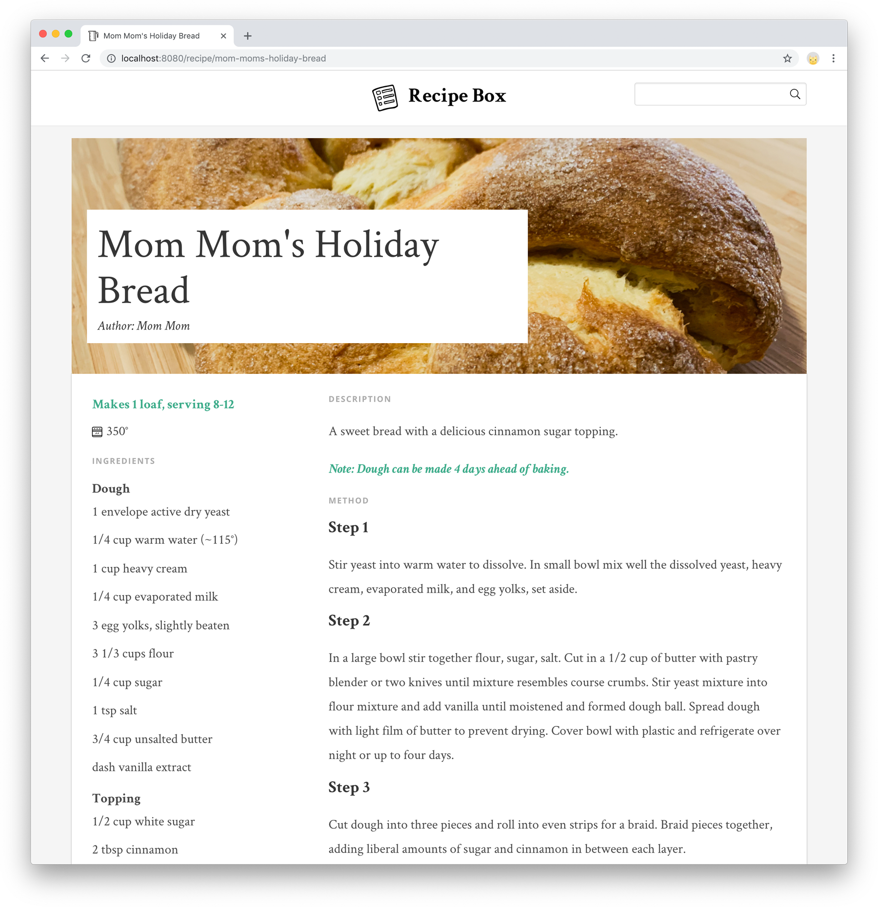

# Recipe Box

>  Recipe app with content managed in [Prismic](https://prismic.io/) headless API CMS.



## Features

- CMS powered by [Prismic](https://prismic.io/).
- Search by title.
- Tag search.
- CSS framework powered by [Bulma](https://bulma.io/).

Demo: [https://secret-citadel-18285.herokuapp.com/](https://secret-citadel-18285.herokuapp.com/)

## Requirements

- Node.js v11+
- npm v6+

## How to launch this project in your local environment

First clone this repo:

```bash
git clone https://github.com/mattsimonis/recipe-box.git
cd recipe-box
```

Then run the following commands:

``` bash
npm install
npm run dev
```

Then you can access it at [http://localhost:8080](http://localhost:8080).

## Prismic Configuration

This repository is linked to the recipe-box Primic instance. To create your own repository, you'll need to follow these steps. This will walk you through creating your repository and the custom content types necessary for the app.

- Create an account on [Prismic](https://prismic.io/).
- From your [dashboard](https://prismic.io/dashboard/), create a new repository. Keep note of the name.
- Open your repository, and go to Custom types.
- Create a new custom type, of type single type, called Homepage.
- In the JSON editor, paste the contents from [Homepage.json](./docs/Prismic/Homepage.json) and save.
- Create a new custom type, of type repeatable type, called Recipe.
- In the JSON editor, paste the contents from [Recipe.json](./docs/Prismic/Recipe.json) and save.

## Prismic Content

Now you have your repository to store your content, and the content types to power the homepage and recipe pages.

Next you'll want to go to Content, and create a Homepage.

Once you have your homepage, you can begin adding recipes which will appear in your app.

## App Configuration

Create a `.env` file for your local configuration. This file is in the `.gitignore`, so it won't be committed.

```bash
echo "PRISMIC_REPOSITORY=your-repository-name" > .env
```

If you deploy your app to Heroku, you can set this via Config Vars.
